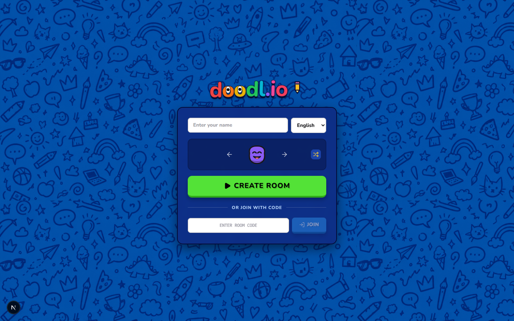
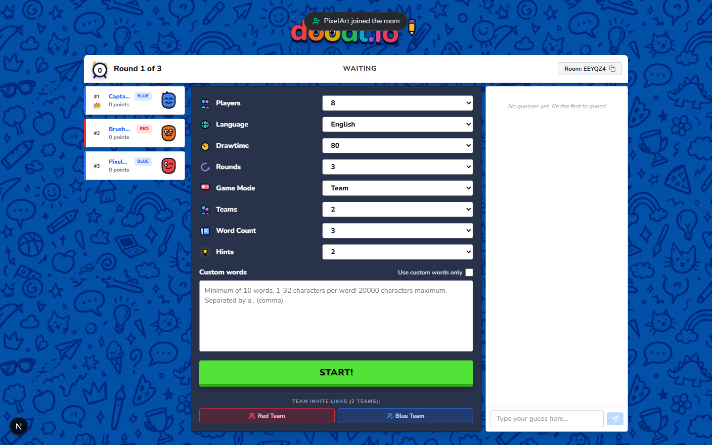
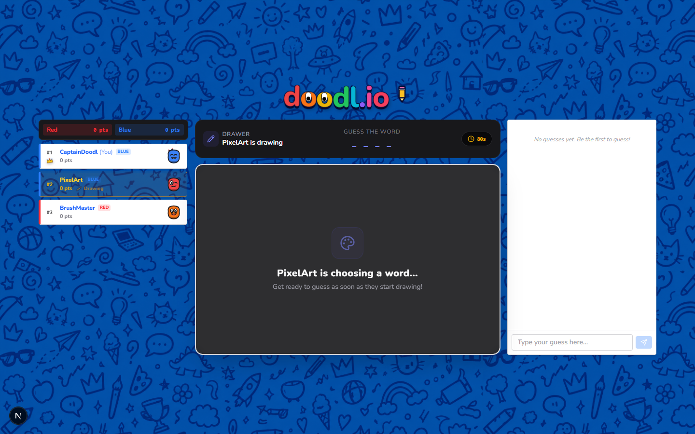
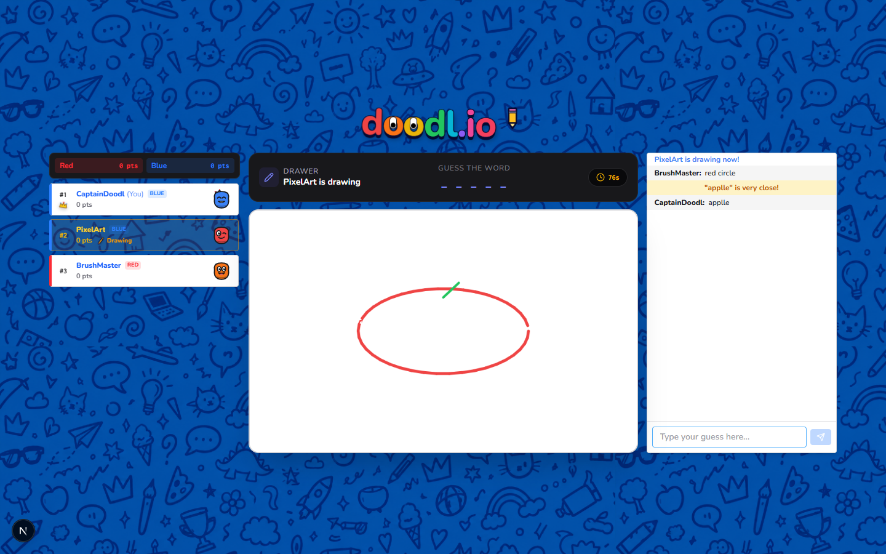
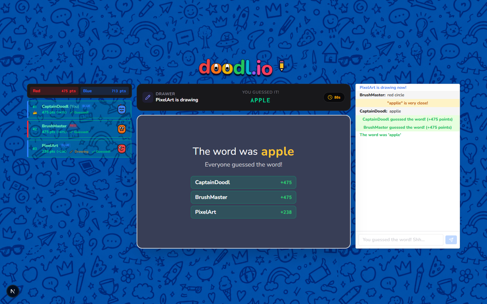
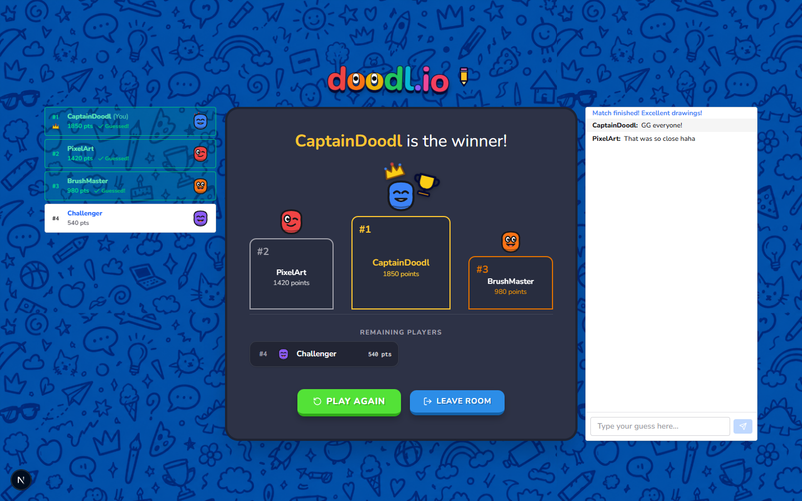
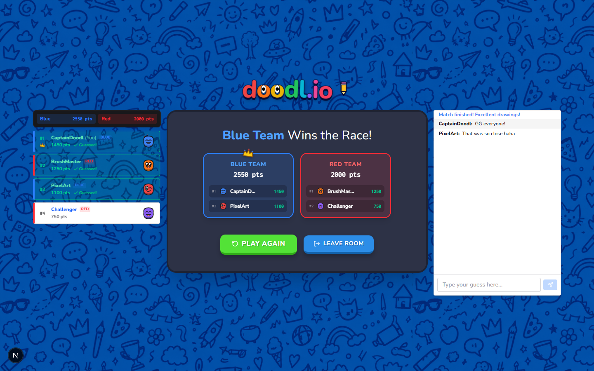

# 🎨 doodl.io — Real-Time Multiplayer Drawing & Guessing Platform

[](https://www.typescriptlang.org/)
[](https://nextjs.org/)
[](https://socket.io/)
[](https://redis.io/)
[](https://opensource.org/licenses/MIT)

A high-fidelity, real-time multiplayer drawing and guessing platform inspired by Skribbl.io. Built with a **stateless compute tier** on Node.js and Socket.IO, **server-authoritative game state** in Redis 7, and a reactive, zero-dependency **Next.js** frontend.

Engineered from the ground up for low-latency vector stroke streaming, resilience against network handoffs, horizontal cluster scaling via Redis Pub/Sub, and anti-cheat information asymmetry.

---

## 📸 Visual Walkthrough & Screenshots

### 1. Landing & Room Setup

* **Interactive Player Identity**: Animated cartoon avatars with live randomization, language selector, and tab-isolated UUID sessions.
* **Instant Join & Code Validation**: One-click room creation or direct 6-character room code joining with automatic capitalization.

### 2. Interactive 3-Column Room Lobby (Multi-Team Mode)

* **Live Roster & Team Badges**: Host automatically assigned to Blue Team in team mode, live player roster with team color badges (Red/Blue/Green/Yellow).
* **Dynamic Team Invite Links**: Dedicated copy-paste invite links generated specifically for the selected team count (e.g. Red & Blue for 2 Teams). The generic invite button is cleanly hidden in Team Mode.
* **Host Match Configuration**: Granular controls for draw time (15s–240s), rounds (1–10), game mode (Normal vs. 2–4 Teams), word count, progressive hints, and custom comma-separated wordpacks.

### 3. Word Selection & Anti-Cheat Overlay

* **Secret Word Choices**: Active drawer selects from 3 difficulty options with character count indicators and countdown timer.
* **Anti-Cheat Information Asymmetry**: While the active drawer selects a secret word, guessers receive a masked canvas overlay with synchronized countdowns; the secret word is never transmitted over the network to non-drawers.

### 4. Real-Time 3-Column Active Gameplay

* **Pure White Vector Canvas**: High-contrast drawing sheet supporting normalized float coordinates (`[0, 1]`) with sub-50ms stroke replication.
* **Masked Word Spacing**: Server-authoritative word masking preserving word spaces and punctuation (e.g. `_ _ _ _ _`).
* **Levenshtein Near-Miss Detection**: Real-time guess box on the right displaying private typo whispers (*"applle" is very close!*) without leaking words in public chat.
* **Live Team Scoreboard**: Live team point headers (`Red 0 pts | Blue 0 pts`) and drawer pencil indicators.

### 5. Turn-End Scorecard & Word Reveal

* **Word Reveal & Reason**: Displays the revealed secret word and reason (*"Everyone guessed the word!"* or *"Time's up!"*).
* **Guesser Feedback Coloring**: Highlights players who guessed the word in emerald green (`+475 pts`) and non-guessers in rose red (`+0 pts`).

### 6. Solo Podium (Top 3 Pedestals + Remaining Rankings)

* **Top 3 3D Pedestals**: Gold (#1 with crown and trophy), Silver (#2), and Bronze (#3) pedestals with avatars and point totals.
* **Remaining Players Table**: Players ranking #4 and below are cleanly displayed with scores in the ranked roster beneath the podium.
* **Match Actions**: Instant *Play Again* and *Leave Room* options.

### 7. Cooperative Team Podium

* **Winning Team Crown**: Crowning banner (*"Blue Team Wins the Race!"*) with total aggregated squad scores.
* **Team Roster Breakdown**: Player contributions broken down by team with individual point values.

---

## 🚀 Key Highlights & Architecture

```
                      [ Next.js Client Sockets ]
                      (sessionStorage UUID Auth)
                                 │
                 ┌───────────────┴───────────────┐
                 ▼                               ▼
       [ Node.js Instance 1 ]          [ Node.js Instance 2 ]
       (Token-Bucket Limiter)          (Token-Bucket Limiter)
                 │                               │
                 └───────────────┬───────────────┘
                                 │
                   [@socket.io/redis-adapter]
                                 ▼
                     [ Redis 7 Cluster / Store ]
       ┌─────────────────────────┼─────────────────────────┐
       ▼                         ▼                         ▼
 [room:{id}:players]      [room:{id}:strokes]       [Pub/Sub Channels]
 (Hashes / TTL 2h)       (Bounded Event Log)       (Inter-Node Fanout)
```

### 1. Parametric Normalized Vector Canvas (`[0, 1]`)
- **Device-Agnostic Resolution**: Mouse and pointer inputs are converted to normalized unit floats between `0.0` and `1.0` before transmission. Drawings scale seamlessly across phones, tablets, and 4K displays with zero clipping or coordinate drift.
- **Microsecond GPU Rasterization**: Instead of streaming heavy 50KB+ bitmap buffers, strokes are compact JSON vector primitives (~80 bytes), cutting network bandwidth by **over 99%**.

### 2. Ephemeral Event-Sourced Stroke Log
- Every validated stroke is appended to an ephemeral Redis list (`room:{roomId}:strokes`).
- Late joiners or page-refreshing players receive the entire drawing history in a single `canvasSync` packet for instantaneous canvas hydration.
- The stroke log is automatically bounded by the turn lifecycle and purged via `clearRoomStrokes` upon turn completion.

### 3. Server-Authoritative Anti-Cheat Engine
- **Zero-Trust Information Asymmetry**: The secret word is never transmitted to non-drawers over the network until the turn ends.
- **Progressive Letter Hints**: At 50% and 75% elapsed turn time, the server randomly unveils unrevealed letter positions and broadcasts masked strings (e.g., `_ O _ _ E`), preserving spaces and punctuation.
- **Levenshtein Near-Miss Detection**: Catches typos within an edit distance of $\le 1$ (or $\le 2$ for longer words) and privately notifies the guesser (*"You are close!"*) without revealing the answer in room chat.

### 4. Resilient Session Persistence & 20s Disconnect Lease
- **Transport vs. Domain Identity Decoupling**: Sockets authenticate using a deterministic client UUID stored in `sessionStorage`, freeing domain identity from transient `socket.id` churn.
- **20-Second Disconnect Grace Period**: When a connection drops due to mobile network handoffs (Wi-Fi $\leftrightarrow$ 5G) or page reloads, a 20s lease preserves player scores, host privileges, and team assignments.
- **Deterministic Host Election**: If the room host leaves or their 20s lease expires, host status migrates seamlessly to the next connected player.

### 5. Configurable Multi-Team Mode (2–4 Teams)
* **Cooperative Party Play**: Enables 2, 3, or 4 distinct teams (**Red**, **Blue**, **Green**, **Yellow**), expanding doodl.io from free-for-all into collaborative squad matches.
* **Lobby Team Cycling**: Players can cycle their team assignment with a single click on their lobby badge. The host can configure the active team count (2, 3, or 4 teams).
* **Deterministic Server Auto-Balancing**: When `startGame` is triggered in Team Mode, the server calculates current team sizes and distributes all unassigned players across the smallest teams to ensure balanced rosters:
  ```ts
  const activeTeams: TeamId[] = (["red", "blue", "green", "yellow"] as TeamId[]).slice(0, teamCount);
  // Iteratively assign unassigned players to the team with the minimum member count
  ```
* **CQRS Read Projection Scoring**: Prevents distributed race conditions by maintaining player score as the single source of truth in Redis (`player.score`). Team scores are projected on-demand via `getTeamScores()` and broadcast via `teamScoresUpdate` upon every correct guess.
* **Winning Team Podium**: When the game concludes, the 3D podium screen prominently crowns the **Winning Team** with their total score and team color theme.
* **Automated End-to-End Verification**:
  ```bash
  node scripts/testTeamMode.cjs --prefix server
  ```

### 6. Edge Rate Limiting & Backpressure Regulation
- Per-socket in-memory token-bucket limiter protects the event loop and Redis from abusive macro drawing scripts and brute-force dictionary spam:
  - `draw`: 50 burst / 40 refill per sec
  - `guess`: 3 burst / 2 refill per sec
  - `clearCanvas`: 2 burst / 1 refill per sec

---

## 📊 Automated Load Testing Benchmark

The platform includes a standalone multi-room load testing suite (`server/scripts/loadTest.ts`) using synthetic concurrent Socket.IO clients.

Run the benchmark:
```bash
npm run benchmark --prefix server
```

### Verified Benchmark Results (20 Clients / 5 Rooms / 10s Stream):
```text
=================================================
🚀 DOODL.IO REAL-TIME WEBSOCKET BENCHMARK
=================================================
Target Server:      http://localhost:4000
Concurrent Rooms:   5
Total Clients:      20 (5 Drawers + 15 Guessers)
Test Duration:      10s
Stroke Rate/Room:   ~33 strokes/sec
-------------------------------------------------
Strokes Emitted:    1,583
Strokes Received:   4,749
Delivery Ratio:     100.0%
-------------------------------------------------
Min Latency:        1 ms
Avg Latency:        3 ms
p50 (Median):       3 ms
p95 Latency:        4 ms
p99 Latency:        16 ms
=================================================
```

---

## 🛠️ Tech Stack

| Layer | Technologies |
| :--- | :--- |
| **Frontend** | [Next.js](https://nextjs.org/) (App Router), [React 19](https://react.dev/), [Tailwind CSS](https://tailwindcss.com/), [Lucide React](https://lucide.dev/), Custom Animated SVGs |
| **Backend** | [Node.js](https://nodejs.org/), [Express](https://expressjs.com/), [Socket.IO 4.8](https://socket.io/), [TypeScript](https://www.typescriptlang.org/), [tsx](https://github.com/privatenumber/tsx) |
| **Data & Pub/Sub**| [Redis 7](https://redis.io/), [ioredis](https://github.com/redis/ioredis), [@socket.io/redis-adapter](https://socket.io/docs/v4/redis-adapter/) |
| **Tooling** | ESLint, PostCSS, Docker Compose |

---

## 📁 Repository Structure

```text
skribble-clone/
├── client/                     # Next.js Frontend Application
│   ├── src/
│   │   ├── app/                # App Router (page.tsx, layout.tsx)
│   │   ├── components/
│   │   │   ├── canvas/         # Canvas, Toolbar, Header, Normalization Utils
│   │   │   ├── chat/           # Chatbox, Guess stream, System alerts
│   │   │   ├── common/         # Avatars, Custom Animated DoodlIcons, Logos
│   │   │   ├── game/           # InGameScoreboard, TurnEndBanner, GamePodium
│   │   │   ├── lobby/          # RoomLobby, PlayerList, LobbySettingsForm
│   │   │   └── modals/         # WordSelectModal
│   │   ├── hooks/              # useGameSocket (Event subscriptions & state)
│   │   ├── lib/                # Socket client & Session Storage UUID DAL
│   │   └── types/              # Client-side Socket event contracts
│   └── package.json
│
├── server/                     # Node.js + Socket.IO Backend
│   ├── src/
│   │   ├── handlers/
│   │   │   ├── chat/           # Guess validation & Levenshtein near-miss logic
│   │   │   ├── draw/           # Stroke ingestion & canvas clear dispatch
│   │   │   ├── game/           # Word selection, Turn triggers, Game lifecycle
│   │   │   └── room/           # Join, Leave, Disconnect lease, Team switching
│   │   ├── lib/                # Redis connection singleton (ioredis)
│   │   ├── services/           # RoomService, PlayerService, TimeService, TeamService
│   │   ├── types/              # Server-side event interfaces & payload contracts
│   │   └── index.ts            # HTTP server, Socket.IO & Redis adapter bootstrap
│   ├── scripts/
│   │   └── loadTest.ts         # Multi-client automated WebSocket benchmark
│   └── package.json
│
└── README.md
```

---

## ⚡ Getting Started

### Prerequisites
- **Node.js**: v18.0.0 or higher
- **npm** or **pnpm**
- **Docker** (for local Redis 7)

---

### 1. Clone the Repository
```bash
git clone https://github.com/divyal-11/skribble-clone.git
cd skribble-clone
```

### 2. Start Redis
Launch a local Redis 7 instance via Docker:
```bash
docker run -d --name doodl-redis -p 6379:6379 redis:7-alpine
```

### 3. Server Setup
```bash
cd server
npm install

# Create environment configuration
cat <<EOF > .env
PORT=4000
REDIS_URL=redis://localhost:6379
CLIENT_ORIGIN=http://localhost:3000
EOF

# Start in development mode (hot-reloading via tsx)
npm run dev
```

### 4. Client Setup
In a new terminal:
```bash
cd client
npm install

# Start Next.js development server
npm run dev
```

Open [http://localhost:3000](http://localhost:3000) in your browser. Open multiple tabs or incognito windows to test real-time drawing and guessing across sessions!

---

## 🧪 Testing & Validation

```bash
# Typecheck client
npm run build --prefix client

# Typecheck and build server
npm run build --prefix server

# Execute automated multi-room WebSocket benchmark
npm run benchmark --prefix server
```

---

## 📜 License

This project is licensed under the MIT License — see the [LICENSE](LICENSE) file for details.
