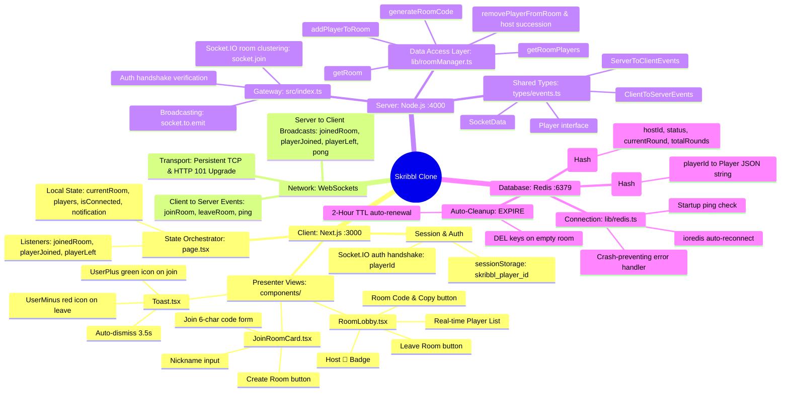

# 📘 Day 2: The Room System, Redis State & Live Lobby Pipeline

---

## 🎯 1. Objective of Day 2

On Day 1, we established raw WebSocket plumbing (`ping` ➔ `pong`). 
The goal of Day 2 was to transform that plumbing into an actual **Multiplayer Room & Lobby System**:
1. **Redis Integration**: Connect Node.js to Redis using `ioredis` to manage ephemeral room state.
2. **Data Access Layer (`roomManager.ts`)**: Encapsulate all room and player queries away from socket handlers.
3. **Session Identity**: Give each browser tab its own persistent player identity using `sessionStorage` and Socket.IO `auth`.
4. **Bidirectional Room Lifecycle**: Implement room creation, code validation, player joining, explicit room leaving, and unexpected disconnections.
5. **Component-Based UI Refactor**: Deconstruct `page.tsx` into modular presenter components (`JoinRoomCard`, `RoomLobby`, `Toast`) with sleek SVG icons.

---

## 🗺️ 2. Architecture Map & Mindmap

### System Architecture Flowchart
```mermaid
flowchart TD
    subgraph Browser["🖥️ CLIENT LAYER (Next.js - Port 3000)"]
        direction TB
        Session["📦 sessionStorage (Persistent Player UUID)"]
        SocketClient["🔌 socket.io-client singleton"]
        Page["📄 page.tsx (State Orchestrator)"]

        subgraph Views["Components"]
            JoinCard["JoinRoomCard.tsx"]
            Lobby["RoomLobby.tsx"]
            ToastComp["Toast.tsx"]
        end

        Session -->|auth: { playerId }| SocketClient
        Page <-->|Emit / Listen| SocketClient
        Page -->|Props| JoinCard
        Page -->|Props| Lobby
        Page -->|Props| ToastComp
    end

    subgraph Network["🌐 WEBSOCKET PROTOCOL"]
        C2S["Client ➔ Server: joinRoom, leaveRoom"]
        S2C["Server ➔ Client: joinedRoom, playerJoined, playerLeft"]
    end

    subgraph Backend["⚙️ SERVER LAYER (Node.js - Port 4000)"]
        Gateway["⚡ index.ts (Event Gateway)"]
        Manager["🛠️ roomManager.ts (Data Access Layer)"]
        RedisModule["🔌 lib/redis.ts (ioredis client)"]

        Gateway <-->|Invoke| Manager
        Manager <-->|Queries & Writes| RedisModule
    end

    subgraph Database["💾 EPHEMERAL STATE (Redis - Port 6379)"]
        RoomMeta[("room:CODE (Hash)\nhostId, status, rounds")]
        RoomRoster[("room:CODE:players (Hash)\nplayerId ➔ JSON")]
        TTL["⏳ 2-Hour TTL (Auto-Expiry)"]

        RedisModule <--> RoomMeta
        RedisModule <--> RoomRoster
        RoomMeta --- TTL
        RoomRoster --- TTL
    end

    SocketClient <==>|Bi-directional Events| Gateway
```

### Complete System Mindmap


---

## 🔄 3. Step-by-Step Pipeline Flows

### Pipeline 1: Player A Creates a Room (The Host Flow)

```text
Tab 1 (Alice)                         Server (index.ts)                       Redis
    │                                         │                                 │
1. Enters "Alice" & clicks "Create Room"      │                                 │
   Generates code: "XK92DF"                   │                                 │
   socket.emit('joinRoom', {                  │                                 │
     roomId: 'XK92DF',                        │                                 │
     playerName: 'Alice'                      │                                 │
   }) ───────────────────────────────────────>│                                 │
                                              │ 2. addPlayerToRoom()            │
                                              │    - Check if room exists       │
                                              │    - Doesn't exist: Alice is 👑 │
                                              │    - HSET room:XK92DF ─────────>│
                                              │    - HSET room:XK92DF:players ─>│
                                              │    - EXPIRE keys (2 hours) ────>│
                                              │                                 │
                                              │ 3. socket.join('XK92DF')        │
                                              │ 4. Emit 'joinedRoom'            │
   5. onJoinedRoom({ players: [Alice] }) <────│                                 │
   - setCurrentRoom('XK92DF')                 │                                 │
   - Switches to RoomLobby view               │                                 │
   - Alice displays with 👑 Host badge        │                                 │
```

---

### Pipeline 2: Player B Joins the Same Room (Multiplayer Sync Flow)

```text
Tab 1 (Alice - in Lobby)              Server (index.ts)             Tab 2 (Bob - on Join Screen)
    │                                         │                                   │
    │                                         │ 1. Enters "Bob", code "XK92DF"    │
    │                                         │    socket.emit('joinRoom') <──────│
    │                                         │                                   │
    │                                         │ 2. addPlayerToRoom() in Redis     │
    │                                         │    - Room exists! Append Bob      │
    │                                         │    - socket.join('XK92DF')        │
    │                                         │                                   │
    │                                         │ 3. socket.emit('joinedRoom')      │
    │                                         │    (Sent ONLY to Bob) ───────────>│
    │                                         │    Bob gets [Alice, Bob]          │
    │                                         │    Bob switches to Lobby view     │
    │                                         │                                   │
    │  4. socket.to('XK92DF').emit(           │                                   │
    │       'playerJoined', { player: Bob }   │                                   │
    │     ) <─────────────────────────────────│                                   │
    │                                                                             │
    │ 5. Alice's client triggers:                                                 │
    │    - setPlayers([Alice, Bob])                                               │
    │    - showNotification("Bob joined the room", "join")                        │
    │    - Green UserPlus toast floats at top!                                    │
```

---

### Pipeline 3: Player B Leaves the Room (Explicit Leave Flow)

```text
Tab 1 (Alice - in Lobby)              Server (index.ts)             Tab 2 (Bob - in Lobby)
    │                                         │                                   │
    │                                         │ 1. Clicks "Leave Room"            │
    │                                         │    socket.emit('leaveRoom') <─────│
    │                                         │                                   │
    │                                         │ 2. removePlayerFromRoom()         │
    │                                         │    - HDEL room:XK92DF:players Bob │
    │                                         │    - socket.leave('XK92DF')       │
    │                                         │                                   │
    │                                         │ 3. Bob's client resets:           │
    │                                         │    - setCurrentRoom(null)         │
    │                                         │    - Returns to JoinRoomCard      │
    │                                         │                                   │
    │  4. socket.to('XK92DF').emit(           │                                   │
    │       'playerLeft', { playerId: Bob }   │                                   │
    │     ) <─────────────────────────────────│                                   │
    │                                                                             │
    │ 5. Alice's client triggers:                                                 │
    │    - setPlayers([Alice]) (removes Bob)                                      │
    │    - showNotification("Bob left the room", "leave")                         │
    │    - Red UserMinus toast floats at top!                                     │
```

---

### Pipeline 4: Host Reassignment (If the Host Leaves)

```text
Host leaves room (clicks leave or closes tab)
      │
      ▼
Server calls removePlayerFromRoom(roomId, hostPlayerId)
      │
      ├─► Is room now empty?
      │     └─► YES: DEL room:{roomId} and DEL room:{roomId}:players (Memory freed!)
      │
      └─► NO: Room still has players remaining!
            └─► Did the leaving player match room.hostId?
                  └─► YES: newHostId = remainingPlayers[0].id
                  └─► HSET room:{roomId} hostId newHostId
                  └─► The next player in line is automatically crowned 👑 Host!
```

---

## 🗄️ 4. Redis Data Structure in Action

When room `XK92DF` has two players, here is the exact shape stored in Redis memory:

### Key 1: `room:XK92DF` (Redis Hash)
| Field | Value | Explanation |
|---|---|---|
| `hostId` | `"f8595a84-2ac4-4609-bf9b-4afa735e3846"` | UUID of the room creator |
| `status` | `"waiting"` | Status machine: waiting ➔ choosing ➔ drawing ➔ roundEnd |
| `currentRound` | `"1"` | Current round number |
| `totalRounds` | `"3"` | Configured total game rounds |

### Key 2: `room:XK92DF:players` (Redis Hash)
| Field (Key) | Value (JSON String) |
|---|---|
| `"f8595a84-..."` (Alice) | `{"id":"f8595a...","name":"Alice","score":0,"hasGuessed":false,"connected":true}` |
| `"c1920b71-..."` (Bob) | `{"id":"c1920b...","name":"Bob","score":0,"hasGuessed":false,"connected":true}` |

*Both keys have a **2-hour TTL** (`EXPIRE`) that auto-renews on any player action.*

---

## 🛠️ 5. Bugs Discovered & Solved Today

| Issue | Root Cause | Solution Implemented |
|---|---|---|
| **Tab 2 overwrote Tab 1 in Redis** | `localStorage` is shared across all tabs in the same browser. Both tabs got the exact same player UUID! | Switched to `sessionStorage` in `client/src/lib/socket.ts`. Now every tab has its own isolated player ID, while refreshing a tab preserves your identity. |
| **"Leave Room" didn't update other tab** | Client emitted `leaveRoom`, but the server had no `socket.on('leaveRoom')` listener! | Added the `leaveRoom` listener in `server/src/index.ts` to call `removePlayerFromRoom`, leave the socket room, and broadcast `playerLeft`. |
| **Silent Player Joins/Leaves** | Players appeared and vanished with zero visual indicator. | Added an animated floating Toast with `lucide-react`'s `UserPlus` (green) and `UserMinus` (red) icons. |
| **Monolithic `page.tsx`** | `page.tsx` ballooned to 300+ lines doing 4 separate jobs. | Extracted pure presenter components (`JoinRoomCard.tsx`, `RoomLobby.tsx`, `Toast.tsx`), shrinking `page.tsx` to a clean 140-line orchestrator. |

---

## 🏁 Day 2 Checkpoint Status
- [x] Redis connection module with error safety & retry strategy
- [x] Redis Data Access Layer (`roomManager.ts`) with auto-host reassignment & TTLs
- [x] Full `joinRoom`, `leaveRoom`, and `disconnect` socket handlers
- [x] Multi-tab verification: Rooms created, joined, and left in real-time
- [x] Clean architecture with `lucide-react` SVG icons and isolated components
- [x] All commits pushed to GitHub: `commit 0a1dbe3`
